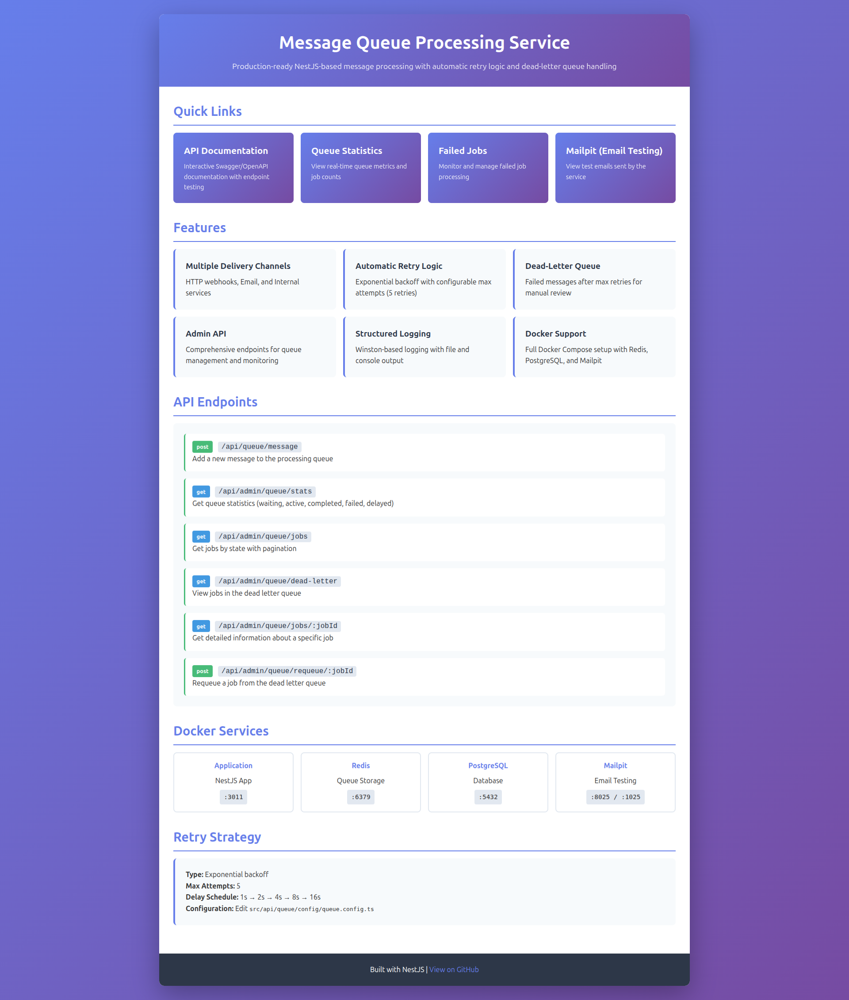
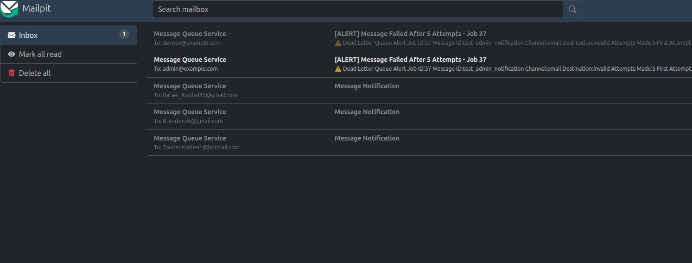

# Message Queue Processing Service

[](https://github.com/BorschCode/nestjs-queue-retry-worker/actions)
[]()
[]()
[]()
[]()
[]()

A production-ready NestJS-based message processing service with automatic retry logic, exponential backoff, and dead-letter queue handling.

---

## Features

- **Multiple Delivery Channels**: HTTP webhooks, Email, and Internal services
- **Automatic Retry Logic**: Exponential backoff with configurable max attempts
- **Dead-Letter Queue**: Failed messages after max retries for manual review
- **Admin API**: Comprehensive endpoints for queue management and monitoring
- **Structured Logging**: Winston-based logging with file and console output
- **Docker Support**: Full Docker Compose setup with Redis, PostgreSQL, and Mailpit
- **Comprehensive Testing**: Unit and integration tests with 100% coverage of core features

---

## Quick Start

### Prerequisites

- Docker and Docker Compose
- Node.js 18+ (for local development)

### Environment Setup

**Important**: Copy the environment file before starting:

```bash
# Copy environment configuration
cp .env.example .env
```

> **Note**: If you don't modify the `.env` file, all URLs and ports mentioned in this README will work as-is.

### Start the Service

```bash
# Start all services
docker compose up -d

# View logs
docker compose logs -f app

# Stop services
docker compose down
```

The application will be available at: **http://localhost:3000**

### API Documentation

Interactive API documentation is available via Swagger/OpenAPI at:

**GitHub Pages**: [Static API Documentation](https://borschcode.github.io/nestjs-queue-retry-worker)

**OpenAPI Specification:**
- **JSON Format**: http://localhost:3000/api/docs-json
- **Swagger UI**: http://localhost:3000/api/docs

**Quick Reference:**
- **Queue Operations**: `POST /api/queue/message`
- **Admin Operations**: `GET /api/admin/queue/*`



See the [Swagger UI](https://borschcode.github.io/nestjs-queue-retry-worker) for complete endpoint details, request/response schemas, and interactive testing.

---

## Architecture Overview

### ⚙️ Processing Rules

#### 1. Message enters the primary queue
When a message is received through the API, it is added to the `messages` queue.

#### 2. Message processor picks up the job
For each job, the processor performs the following steps:

**Step A — Determine delivery channel**

Based on the `channel` field, route the message to the appropriate delivery handler:
- If `channel = "http"` → deliver via HTTP webhook (POST request)
- If `channel = "internal"` → call an internal microservice (HTTP or RPC)
- If `channel = "email"` → send an email through the configured mail provider
- If the channel is unknown → fail immediately

#### 3. Attempt delivery
Each handler attempts to deliver the message using its channel:

**HTTP Webhook Delivery**
- Send POST {destination} with data
- If response is not 2xx → delivery fails
- Timeouts or exceptions also count as failures

**Internal Service Delivery**
- Use HTTP or RPC call to internal service
- Retry on transport errors, 5xx responses

**Email Delivery**
- Send email using SMTP or email provider
- If the provider returns an error → fail
- If rate-limited → treat as temporary failure

#### 4. Retry mechanism
If delivery fails:
- The job is retried automatically
- Retries use exponential backoff (Example: 2s → 4s → 8s → 16s → 32s)
- Maximum retry attempts: configurable (default: 5 attempts)
- During each retry, the system logs the attempt number and error

#### 5. Dead-Letter Queue (DLQ)
If the job exhausts all retry attempts, the system:
- Moves the message to a dead-letter queue
- Triggers the DLQ handler

#### 6. Dead-Letter Processing
When a job reaches the DLQ:
- Log the failure with message details
- Notify the system (email, Slack, monitoring tool)
- Store failed message for manual review
- Provide an endpoint to requeue the message manually

### 📦 Required Handlers

**Primary Queue Processor**
- Determines delivery channel
- Executes channel-specific handler
- Throws errors on failure
- Supports retry and exponential backoff
- Sends exhausted jobs to DLQ

**Channel Handlers**
- HTTP Handler
- Internal Service Handler
- Email Handler

**Dead-Letter Queue Processor**
- Logs failed messages
- Sends alerts
- Saves message for operators
- Allows manual recovery/replay later

### Delivery Channels

The service supports three types of delivery channels:

1. **HTTP Webhook Channel** (`@nestjs/axios`)
   - POST requests to external webhooks
   - Configurable timeout and headers
   - Automatic retry on failure

2. **Email Channel** (Nodemailer)
   - SMTP-based email delivery
   - Supports Mailpit for testing
   - HTML and plain text support

3. **Internal Service Channel**
   - Inter-service communication
   - Microservice integration
   - Extensible for custom logic

### Queue System

```
Message → Main Queue → Processor → Delivery Channel
                ↓ (on failure)
            Retry with Backoff
                ↓ (after max retries)
           Dead-Letter Queue
```

### Retry Strategy

- **Type**: Exponential backoff
- **Max Attempts**: 5
- **Delay Schedule**: 1s → 2s → 4s → 8s → 16s
- **Configurable**: Edit `src/queue/config/queue.config.ts`

---

## Project Structure

### Layer-based Architecture

This project follows a **layer-based (API-first)** architecture that organizes code by API domains and functionality:

```
src/
├── api/
│   ├── queue/
│   │   ├── channels/                 # Delivery channel implementations
│   │   │   ├── base-delivery.channel.ts
│   │   │   ├── http-webhook.channel.ts
│   │   │   ├── email.channel.ts
│   │   │   ├── internal-service.channel.ts
│   │   │   └── delivery-channel.factory.ts
│   │   ├── config/
│   │   │   └── queue.config.ts       # Queue and retry configuration
│   │   ├── dto/                      # Data Transfer Objects
│   │   ├── interfaces/               # TypeScript interfaces
│   │   │   ├── message-payload.interface.ts
│   │   │   ├── delivery-channel.interface.ts
│   │   │   └── job-data.interface.ts
│   │   ├── processors/               # BullMQ job processors
│   │   │   ├── message.processor.ts
│   │   │   └── dead-letter.processor.ts
│   │   ├── services/
│   │   │   └── message-queue.service.ts  # Queue management service
│   │   ├── queue.controller.ts       # Queue API endpoints
│   │   └── queue.module.ts
│   └── admin/
│       └── admin.controller.ts       # Admin & monitoring endpoints
├── config/
│   └── logger.config.ts              # Winston logger configuration
├── app.controller.ts                 # Home page (no API prefix)
├── app.module.ts
├── app.service.ts
└── main.ts
```

### API Endpoint Structure

- **Queue Operations**: `/api/queue/message`
- **Admin Operations**: `/api/admin/queue/*`
- **Home Page**: `/` (no prefix)

This structure provides clear separation of concerns and makes the codebase more maintainable and scalable.

---

## Architecture Benefits

- **Domain Separation**: Clear boundaries between queue operations and admin functions
- **Scalability**: Easy to add new API domains under `/api/`
- **Maintainability**: Related functionality grouped together
- **Testing**: Isolated modules for better unit testing
- **API Versioning**: Future versions can be added as `/api/v2/`

---

## Task Description

This project implements a **NestJS-based message processing service** that handles messages returned to the queue due to delivery failures. The service attempts to deliver each message to the designated channel (HTTP webhook, internal service, email, etc.) using **retry logic with backoff**. After exceeding the maximum retry limit, the message is moved to a **dead-letter queue**, and an error-handling workflow is triggered (logging, alerting, manual review).

**📋 [Acceptance Criteria](docs/ACCEPTANCE_CRITERIA.md)** - Detailed requirements and testing guidelines

## Development

### Install Dependencies

```bash
# Inside the app container
docker compose exec app npm install

# Or locally
npm install
```

### Run Tests

```bash
# Unit tests
docker compose exec app npm test

# Test with coverage
docker compose exec app npm run test:cov

# E2E tests
docker compose exec app npm run test:e2e

# Watch mode
docker compose exec app npm run test:watch
```

### Build Application

```bash
docker compose exec app npm run build
```

### Environment Variables

Copy the example environment file and customize as needed:

```bash
cp .env.example .env
```

Default ports when using `.env.example`:
- **App**: http://localhost:3000
- **Mailpit Web UI**: http://localhost:8025
- **PostgreSQL**: localhost:5432
- **Redis**: localhost:6378

---

## Usage Examples

### Send HTTP Webhook Message

```bash
curl -X POST http://localhost:3000/api/queue/message \
  -H "Content-Type: application/json" \
  -d '{
    "id": "msg-001",
    "channel": "http",
    "destination": "https://webhook.site/your-unique-id",
    "data": {
      "orderId": "12345",
      "status": "completed"
    }
  }'
```

### Send Email Message

```bash
curl -X POST http://localhost:3000/api/queue/message \
  -H "Content-Type: application/json" \
  -d '{
    "id": "msg-002",
    "channel": "email",
    "destination": "test@example.com",
    "data": {
      "from": "noreply@example.com",
      "subject": "Test Email",
      "text": "This is a test email",
      "html": "<h1>Test Email</h1>"
    }
  }'
```

View emails at: **http://localhost:8025** (Mailpit web UI)




### Check Queue Statistics

```bash
curl http://localhost:3000/api/admin/queue/stats
```

### View Failed Jobs

```bash
curl "http://localhost:3000/api/admin/queue/jobs?state=failed"
```

---

## Monitoring and Logging

### View Application Logs

```bash
# Follow all logs
docker compose logs -f app

# View error logs
docker compose exec app tail -f logs/error.log

# View combined logs
docker compose exec app tail -f logs/combined.log
```

### Log Format

Logs include:
- Timestamp
- Log level (info, error, warn)
- Context (service/module name)
- Message details
- Stack traces for errors

Example:
```
2025-12-02T12:00:00.000Z [MessageProcessor] info: Processing job 1 for message msg-001 (attempt 1/5)
2025-12-02T12:00:01.000Z [MessageProcessor] info: Successfully delivered message msg-001
```

---

## Docker Services

| Service | Image | Port | Description |
|---------|-------|------|-------------|
| app | nestjs-app | 3000 | Main application |
| redis | redis:7-alpine | 6379 | Queue storage |
| postgres | postgres:15 | 5432 | Database (future use) |
| mailpit | axllent/mailpit | 8025 (web), 1025 (smtp) | Email testing |

---
